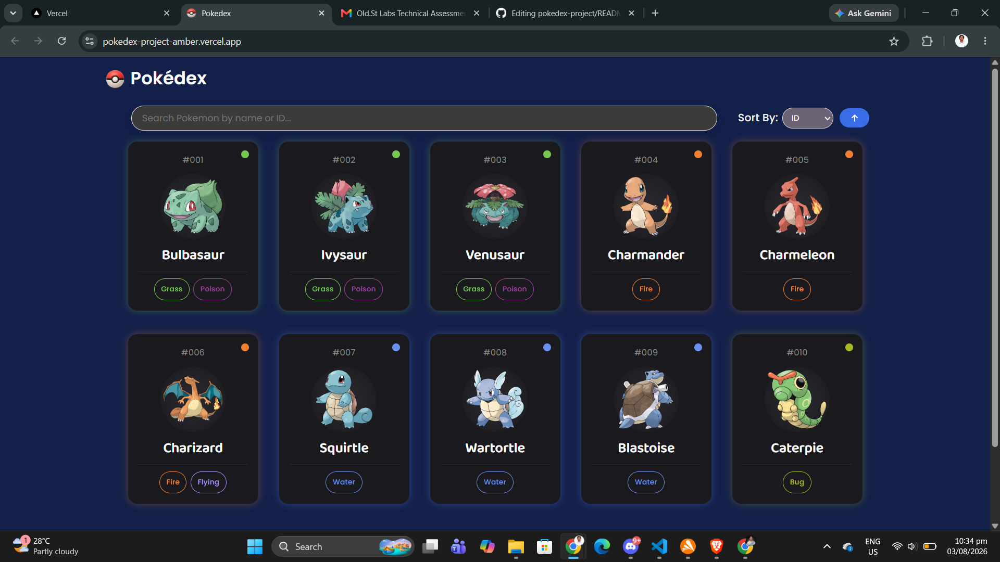
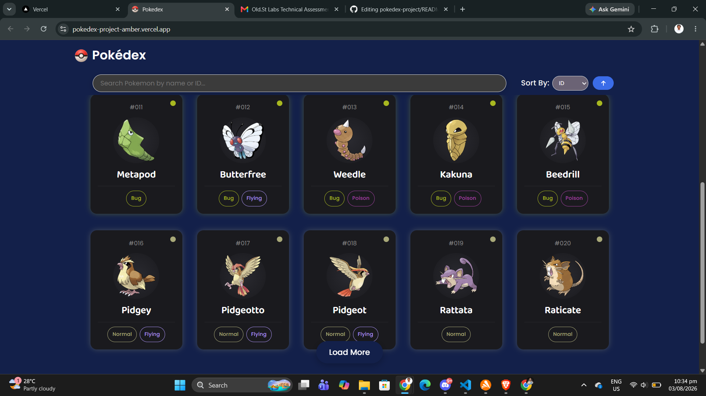
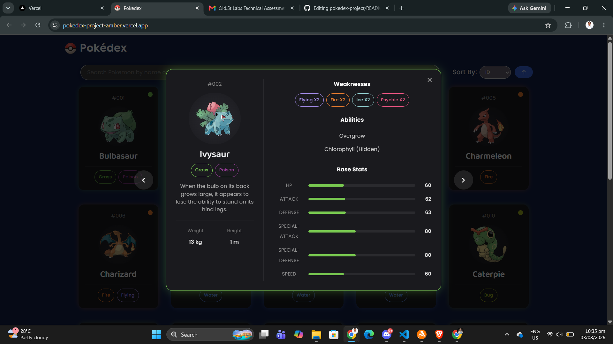

# Pokédex

A simple and responsive Pokédex web application built with **React** and **Vite** that allows users to browse, search, and view Pokémon information using the **PokéAPI**.

## Features

- Browse Pokémon
- Search Pokémon by **name** or **ID**
- Display Pokémon:
  - Official artwork
  - Name
  - ID
  - Type(s)
- Responsive card-based layout
- Dynamic data fetched from the PokéAPI
- Fast development powered by Vite
- Sort Pokémon by **name** or **ID**
- View more Pokémon information through a pop-up modal

## Technologies Used

- React
- Vite
- JavaScript (ES6+)
- CSS3
- PokéAPI
- Fetch API

## APIs Used

### Pokémon Data

https://pokeapi.co/

Example:

```
https://pokeapi.co/api/v2/pokemon/25
```

### Pokémon Images

```
https://assets.pokemon.com/assets/cms2/img/pokedex/full/{id}.png
```

Example:

```
https://assets.pokemon.com/assets/cms2/img/pokedex/full/025.png
```

## Screenshots





## Acknowledgements

- PokéAPI for providing the Pokémon data
- Pokémon.com for the Pokémon artwork
- React
- Vite

## License

This project is for educational purposes.
